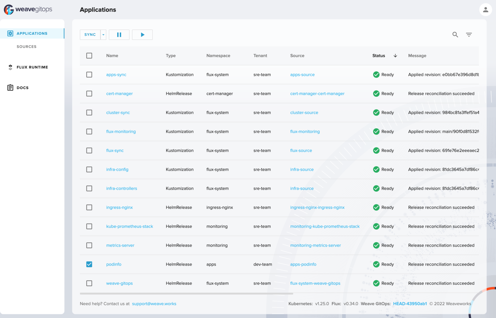

# flux-local-dev

[](https://github.com/stefanprodan/flux-local-dev/actions)
[](https://github.com/stefanprodan/flux-local-dev/blob/main/LICENSE)
[](https://github.com/stefanprodan/flux-local-dev/releases)

Spin up a local dev environment for [Flux](https://github.com/fluxcd/flux2)
with Docker and Kubernetes KIND in under five minutes.

## Who is this for?

- **Flux users** who want to test Flux configs locally, without having to push changes to a Git repository.
  Config changes are pushed to a local registry and synced on the cluster by Flux automatically.
- **Flux contributors** who want to test their changes to Flux controllers locally,
  without having to push the container images to an external registry.
- **Flux maintainers** who want to test Flux prereleases on various Kubernetes versions and configurations.

## How does it work?

This project spins up a Docker Registry container named `kind-registry` and a Kubernetes Kind cluster
named `flux` under the same Docker network. Then it installs Flux and configures it to upgrade itself
from the latest OCI artifact published at `ghcr.io/fluxcd/flux-manifests`. Before an upgrade, Flux
verifies that the OCI artifacts are signed by the Flux team with Cosign and GitHub OIDC.

| Component                                                                                                | Role                            | Host                        |
|----------------------------------------------------------------------------------------------------------|---------------------------------|-----------------------------|
| [Kubernetes KIND](https://kind.sigs.k8s.io/)                                                             | Local cluster                   | Binds to port 80 and 443    |
| [Docker Registry](https://docs.docker.com/registry/)                                                     | Local registry                  | Binds to port 5050          |
| [Flux](https://fluxcd.io)                                                                                | Cluster reconciler              | -                           |
| [ingress-nginx](https://github.com/kubernetes/ingress-nginx)                                             | Ingress for `*.flux.local`      | -                           |
| [cert-manager](https://github.com/cert-manager/cert-manager)                                             | Self-signed ingress certs       | -                           |
| [metrics-server](https://github.com/kubernetes-sigs/metrics-server)                                      | Container resource metrics      | -                           |
| [kube-prometheus-stack](https://artifacthub.io/packages/helm/prometheus-community/kube-prometheus-stack) | Prometheus Operator and Grafana | Binds to grafana.flux.local |
| [weave-gitops](https://github.com/weaveworks/weave-gitops)                                               | Flux UI                         | Binds to ui.flux.local      |
| [podinfo](https://github.com/stefanprodan/podinfo)                                                       | Demo app                        | Binds to podinfo.flux.local |

The Docker registry is exposed on the local machine on `localhost:5050` and inside the cluster
on `kind-registry:5000`. The registry servers two purposes:
- hosts container images e.g. `docker push localhost:5050/podinfo:test1`
- hosts OCI artifacts e.g. `flux push artifact oci://localhost:5050/podinfo-manifests:test1`

To facilitate ingress access to the Flux UI and any other
application running inside the cluster, the Kubernetes Kind container
binds to port `80` and `443` on localhost.
Ingress is handled by Kubernetes ingress-nginx and self-signed TLS certs
are provided by cert-manager.

To monitor how the deployed applications perform on the cluster,
the kube-prometheus-stack and metrics-server Helm charts are installed at
bootstrap along with the Flux Grafana dashboards.

To monitor and debug Flux using a Web UI, the Weave GitOps Helm chart is
installed at bootstrap.


## How to get started?

### Prerequisites

Start by cloning the repository locally:

```shell
git clone https://github.com/stefanprodan/flux-local-dev.git
cd flux-local-dev
```

Install Kubernetes kind, kubectl, flux and other CLI tools with Homebrew:

```shell
make tools
```

The complete list of tools can be found in the `Brewfile`.
Note that the minimum required version of Flux is v0.41.0.

### Bootstrap

Start the dev environment with:

```shell
make up
```

The `make up` command performs the following steps:
- creates the Docker registry container if it's not already running
- creates the Kubernetes Kind cluster if it's not already running
- pushes the Kubernetes manifests as OCI artifacts to the local registry
  - `locahost:5050/flux-cluster-sync` is generated from `kubernetes/clusters/local`
  - `locahost:5050/flux-infra-sync` is generated from `kubernetes/infra`
  - `locahost:5050/flux-apps-sync` is generated from `kubernetes/apps`
- installs Flux on the clusters and configures it to self upgrade from `oci://ghcr.io/fluxcd/flux-manifests`
- waits for Flux to reconcile the cluster addons from `oci://kind-registry:5000/flux-infra-sync`
- waits for Flux to reconcile the demo apps from `oci://kind-registry:5000/flux-apps-sync`

### Access Flux UI



Add the following domains to `/etc/hosts`:

```txt
127.0.0.1 podinfo.flux.local
127.0.0.1 grafana.flux.local
127.0.0.1 ui.flux.local
```

Verify that the NGINX ingress self-signed TLS works:

```shell
make check
```

Access the Flux UI and Grafana using the username `admin` and password `flux`:

- [http://ui.flux.local/applications](http://ui.flux.local/applications)
- [http://grafana.flux.local/d/flux-control-plane](http://grafana.flux.local/d/flux-control-plane/flux-control-plane?orgId=1&refresh=10s)
- [http://grafana.flux.local/d/flux-cluster](http://grafana.flux.local/d/flux-cluster/flux-cluster-stats?orgId=1&refresh=10s)

Access the demo application on [http://podinfo.flux.local](http://ui.flux.local/).

### Sync local changes

Add a label to the `apps` namespace definition:

```shell
yq eval '.metadata.labels.env="dev"' -i ./kubernetes/apps/namespace.yaml
```

Validate the Kubernetes manifests and Flux custom resources:

```shell
make validate
```

Push the changes to the local registry with:

```shell
make sync
```

Verify that Flux has reconciled the namespace:

```shell
kubectl get ns apps --show-labels
```

### Teardown

Delete the registry and the Kubernetes cluster with:

```shell
make down
```

## How to use CUE for manifests generation?

In the [cue](/cue) directory you can find an example of how to use
[cuelang](https://cuelang.org/)
to define and generate Kubernetes resources.

List the CUE generated resources with `make cue-ls`:

```console
$ make cue-ls

RESOURCE                                   API VERSION
Namespace/cue-apps                         v1
ServiceAccount/cue-apps/flux-cue-apps      v1
Service/cue-apps/podinfo                   v1
ServiceAccount/cue-apps/podinfo            v1
Deployment/cue-apps/podinfo                apps/v1
HorizontalPodAutoscaler/cue-apps/podinfo   autoscaling/v2beta2
Ingress/cue-apps/podinfo                   networking.k8s.io/v1
ServiceMonitor/cue-apps/podinfo            monitoring.coreos.com/v1
RoleBinding/cue-apps/flux-cue-apps         rbac.authorization.k8s.io/v1
```

Push the generated resources to the local registry with `make cue-push`:

```console
$ make cue-push 
► pushing artifact to localhost:5050/flux-cue-apps-sync:local
✔ artifact successfully pushed to localhost:5050/flux-cue-apps-sync@sha256:59676338abbb245a80345713fea24c2686c8c38cbd235691dd0af0fdc00fe116
```

To reconcile the resources on the cluster, add a file called `cue-apps.yaml` to the `kubernetes/cluster/local` directory:

```yaml
---
apiVersion: source.toolkit.fluxcd.io/v1beta2
kind: OCIRepository
metadata:
  name: cue-apps-source
  namespace: flux-system
spec:
  insecure: true
  interval: 1m
  provider: generic
  ref:
    tag: local
  url: oci://kind-registry:5000/flux-cue-apps-sync
---
apiVersion: kustomize.toolkit.fluxcd.io/v1beta2
kind: Kustomization
metadata:
  name: cue-apps-sync
  namespace: flux-system
spec:
  dependsOn:
    - name: infra-config
  interval: 5m
  retryInterval: 30s
  timeout: 5m
  path: ./
  prune: true
  sourceRef:
    kind: OCIRepository
    name: cue-apps-source
```

Sync the changes on the cluster with:

```shell
make sync
```

List the reconciled objects with:

```console
$ flux tree ks cue-apps-sync 
Kustomization/flux-system/cue-apps-sync
├── Namespace/cue-apps
├── ServiceAccount/cue-apps/flux-cue-apps
├── ServiceAccount/cue-apps/podinfo
├── RoleBinding/cue-apps/flux-cue-apps
├── Service/cue-apps/podinfo
├── Deployment/cue-apps/podinfo
├── HorizontalPodAutoscaler/cue-apps/podinfo
├── ServiceMonitor/cue-apps/podinfo
└── Ingress/cue-apps/podinfo
```

If you make changes to the CUE definitions, run `make cue-push` and Flux will apply the changes on its own.

## How to test Flux controllers?

Assuming you are contributing a change to kustomize-controller,
and you want to run a series of end-to-end tests before opening a PR.
Most importantly, you want to make sure your changes don't break Flux
capability to upgrade itself.

### Build and push the controller image

From within the kustomize-controller local clone, run `make docker-build` to build the controller image.
If your local machine is an Apple M1, set the arch to `linux/arm64` and run:

```shell
IMG=localhost:5050/kustomize-controller:latest make docker-build docker-push
BUILD_PLATFORMS=linux/arm64 make docker-build
```

Tag and push the image to your local registry:

```shell
docker tag fluxcd/kustomize-controller:latest localhost:5050/kustomize-controller:test1
docker push localhost:5050/kustomize-controller:test1
```

### Deploy the controller

From within the flux-local-dev clone, open the `kubernetes/clusters/local/flux-system/flux-sync.yaml` file
and add an image patch:

```yaml
apiVersion: kustomize.toolkit.fluxcd.io/v1beta2
kind: Kustomization
metadata:
  name: flux-sync
  namespace: flux-system
spec:
  images:
    - name: ghcr.io/fluxcd/kustomize-controller
      newName: localhost:5050/kustomize-controller
      newTag: test1
```

Sync the changes on the cluster with `make sync` and verify that the image is being rolled out:

```shell
make sync
kubectl -n flux-system get deploy/kustomize-controller --watch
```

Finally, verify that the upgrade was successful with:

```console
$ flux check 

✔ kustomize-controller: deployment ready
► localhost:5050/kustomize-controller:test1
```

If you don't want to bump the image tag on every build, you can bypass the local registry
and import the image directly in the cluster cache:

```shell
export IMG=localhost:5050/kustomize-controller:test1
IMG=${IMG} make docker-build &&
kind import docker-image ${IMG} &&
kubectl delete pod -n flux-system -l app=kustomize-controller
```

## How to test Flux prereleases?

Assuming you are maintainer, and you want to test the Flux controller suite
before a release.

### Build and push the manifests

From within the flux2 local clone, run `make build-dev` to build the Flux CLI
binary that embeds the install manifests.

Extract the manifests to a directory with:

```shell
mkdir -p flux-vnext

./bin/flux install --components-extra=image-reflector-controller,image-automation-controller \
--export > ./flux-vnext/install.yaml
```

Push the manifests to your local registry:

```shell
./bin/flux push artifact oci://localhost:5050/flux:latest --path ./flux-vnext \
--source="$(git config --get remote.origin.url)" \
--revision="$(git rev-parse HEAD)"
```

### Deploy the controllers

From within the flux-local-dev clone, open the `kubernetes/clusters/local/flux-system/flux-source.yaml` file,
change the URL to point to your local registry and enable the insecure flag:

```yaml
apiVersion: source.toolkit.fluxcd.io/v1beta2
kind: OCIRepository
metadata:
  name: flux-source
  namespace: flux-system
spec:
  url: oci://kind-registry:5000/flux
  insecure: true
```

Sync the changes on the cluster with `make sync` and wait for the new version to rollout:

```shell
make sync
flux reconcile ks flux-sync --with-source
```

Finally, verify that the upgrade was successful with:

```shell
flux check 
```

## How to test Flux CRDs?

Assuming you are contributing an API change to source-controller,
and you want to run a series of end-to-end tests before opening a PR.

### Build and push the controller image

From within the source-controller local clone, run `make docker-build` to build the controller image.
If your local machine is an Apple M1, set the arch to `linux/arm64` and run:

```shell
IMG=localhost:5050/source-controller \
TAG=oci1 \
BUILD_PLATFORMS=linux/arm64 \
BUILD_ARGS=--load \
make docker-build docker-push
```

### Build and push the manifests

From within the source-controller local clone, extract the Flux manifests to a directory:

```shell
mkdir -p flux-vnext

flux install --components-extra=image-reflector-controller,image-automation-controller \
--export > ./flux-vnext/install.yaml
```

Replace the CRD with the one from your branch:

```shell
export CRD_NAME="ocirepositories.source.toolkit.fluxcd.io"
yq e 'select(.metadata.name != env(CRD_NAME))' -i ./flux-vnext/install.yaml

CRD_BASE_PATH="./config/crd/bases"
CRD_FILE_NAME="source.toolkit.fluxcd.io_ocirepositories.yaml"
cp ${CRD_BASE_PATH}/${CRD_FILE_NAME} ./flux-vnext/
```

Push the manifests to your local registry:

```shell
flux push artifact oci://localhost:5050/flux:latest --path ./flux-vnext \
--source="$(git config --get remote.origin.url)" \
--revision="$(git rev-parse HEAD)"
```

### Deploy the controller

From within the flux-local-dev clone, open the `kubernetes/clusters/local/flux-system/flux-source.yaml` file,
change the URL to point to your local registry and enable the insecure flag:

```yaml
apiVersion: source.toolkit.fluxcd.io/v1beta2
kind: OCIRepository
metadata:
  name: flux-source
  namespace: flux-system
spec:
  url: oci://kind-registry:5000/flux
  insecure: true
```

Open the `kubernetes/clusters/local/flux-system/flux-sync.yaml` file
and patch the controller deployment with the local image:

```yaml
apiVersion: kustomize.toolkit.fluxcd.io/v1beta2
kind: Kustomization
metadata:
  name: flux-sync
  namespace: flux-system
spec:
  images:
    - name: ghcr.io/fluxcd/source-controller
      newName: localhost:5050/source-controller
      newTag: oci1
```

Sync the changes on the cluster with `make sync` and wait for the new version to rollout:

```shell
make sync
flux reconcile ks flux-sync --with-source
```

### Manual testing

Test the new feature by adding a Flux resource to the `kubernetes/apps/source-test.yaml`:

```yaml
apiVersion: source.toolkit.fluxcd.io/v1beta2
kind: OCIRepository
metadata:
  name: podinfo-keyless
  namespace: apps
spec:
  interval: 5m
  url: oci://ghcr.io/stefanprodan/manifests/podinfo
  ref:
    semver: "*"
  verify:
    provider: cosign
```

Sync the changes on the cluster and see the reconciliation result:

```shell
make sync
flux get source oci podinfo-keyless -n apps
```
